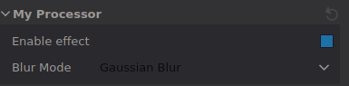

# Create your own Processor
This guide will walk you through the creation of a new processor.

## Creating the processor
There are three ways to create a new processor in Inviwo:
1. **Using the GUI**: Just click the `Tools -> Create Sources -> Add Processor` button, navigate to `<module-dir>/src/processors` and specify your processor name in PascalCase (e.g. `MyNewProcessor`).
2. **Using the Inviwo-meta-cli**: Check out the Inviwo-meta docs (TODO: link)
3. **Manually**:
    In order to create a new processor in Inviwo, you need to create the source files for the processor itself, register it in the according module and add it to the Cmake files.
    Inviwo-meta does all of those things for you automatically. The following describes the files that need to be created or modified:
    1. You need to create the processors source and header files in `<module-dir>/src/processors/`
    2. The processor needs to be registered in its module. To do so, open the `<module-dir>/src/<module-name>module.cpp` and include your processor's header, then add the following line to the module's constructor:
    ```
        registerProcessor<MyNewProcessor>();
    ```
    3. Add your new processor's header and source to the module's `CMakeLists.txt` (`<module-dir>/CMakeLists.txt`)

We suggest using the GUI whenever possible.

If you have created your new processor using the GUI or Inviwo-meta, you can see there is already a class definition in your created files. If you created the files manually, make sure your class is implemented accordingly. The following describes the necessary methods of a processor. Note that you can compare this directly to the example below.

Your processor needs to be a subclass of `Processor` and it needs to override the `void Processor::process()` method. The `process()` method is where a processor's action is implemented.
Additionally, you can override the `const ProcessorInfo getProcessorInfo() const` method which returns meta information about the processor, like a class identifier (unique, in URI style), name, category, tags etc. Make sure to adjust these appropriately.
Further, your processor needs to define a constructor to initialize all your properties and a destructor (which will usually be the default destructor).
<details><summary>Click to expand</summary>

This example shows what is generated for the new processor `MyProcessor` in the `postprocessing` module.

### myprocessor.h

```
#pragma once

#include <modules/postprocessing/postprocessingmoduledefine.h>
#include <inviwo/core/common/inviwo.h>
#include <inviwo/core/processors/processor.h>
#include <inviwo/core/properties/ordinalproperty.h>
#include <inviwo/core/ports/imageport.h>

namespace inviwo {

class IVW_MODULE_POSTPROCESSING_API MyProcessor : public Processor {
public:
    MyProcessor();
    virtual ~MyProcessor() = default;

    virtual void process() override;

    virtual const ProcessorInfo getProcessorInfo() const override;
    static const ProcessorInfo processorInfo_;

private:
    ImageOutport outport_;
    FloatVec3Property position_;
};

}  // namespace inviwo

```

### myprocessor.cpp

```
#include <modules/postprocessing/processors/myprocessor.h>

namespace inviwo {

// The Class Identifier has to be globally unique. Use a reverse DNS naming scheme
const ProcessorInfo MyProcessor::processorInfo_{
    "org.inviwo.MyProcessor",      // Class identifier
    "My Processor",                // Display name
    "Undefined",              // Category
    CodeState::Experimental,  // Code state
    Tags::None,               // Tags
};
const ProcessorInfo MyProcessor::getProcessorInfo() const { return processorInfo_; }

MyProcessor::MyProcessor()
    : Processor()
    , outport_("outport")
    , position_("position", "Position", vec3(0.0f), vec3(-100.0f), vec3(100.0f)) {

    addPort(outport_);
    addProperty(position_);
}

void MyProcessor::process() {
    // outport_.setData(myImage);
}

}  // namespace inviwo

```
</details>

Below we will go through the implementation of an example processor that takes an input image, performs a filter operation and outputs the results.

## Inports and Outports - How to receive and send data to/from other processors
Ports are used as the primary way of sending data between processors. You can add ports as private members of your class and initialize them in the constructor. Ports also need to be added to the processor using `addPort()`, otherwise they won't be displayed. Note that the convention is to put optional inports to the right of the processor (added last). If your processor performs some kind of rendering, it should usually also include an optional `ImageInport`, where previously rendered parts of an image can be passed through, so that the processor's outport produces a composited image of the current and previous renderings.

To access data from an inport, you can use the `getData()` method. To output data through an outport, you can use the `setData(...)` method.

**Example**: Let's change `MyProcessor` to receive and produce an image.
```
// MyProcessor.h (inside class definition)
private:
    ImageInport inport_;    // Define ports
    ImageOutport outport_;

// MyProcessor.cpp (constructor)
MyProcessor::MyProcessor()
    : Processor()
    , inport_("imageInport")      // Initialize ports
    , outport_("imageOutport") {

    addPort(inport_);  // Add ports
    addPort(outport_);
}
```
Note that the automatically generated processor template also has a `FloatVec3Property`. This is omitted here. Properties will be discussed below.

## process() - Implement functionality
The `process()` method is where the functionality of your processor is defined. Every time the processor is invalidated (either by changing inputs, events or property changes), the `process()` method is executed.
Inside `process()` you can access your inports' data by using `inport_.getData()` and similarly you can write data to the outports using `outport_.setData(...)`. What happens with your data in between is fully up to you.
You can also use all your defined properties here. This let's you access all your algorithm's parameters directly from the GUI with automatic updates upon change.

**Example**: Let's have our processor apply gaussian blur to the input image.
```
// MyProcessor.h (next to the other includes)
#include <modules/basegl/algorithm/imageconvolution.h>

// MyProcessor.h (inside class definition)
private:
    ImageInport inport_;
    ImageOutport outport_;

    ImageConvolution conv_;  // This will apply the convolution for us on the GPU
    const std::vector<float> gaussianKernel_ = { // Convolution kernel
        1, 2, 1,
        2, 4, 2,
        1, 2, 1
    };

// MyProcessor.cpp (constructor)
MyProcessor::MyProcessor()
    : Processor()
    , inport_("imageInport")
    , outport_("imageOutport")
    , conv_([&]() { this->invalidate(InvalidationLevel::InvalidOutput); }) {

    addPort(inport_);
    addPort(outport_);
}

// MyProcessor.cpp (process())
void MyProcessor::process() {
    auto img = inport_.getData();  // Get image from inport
    // convolution() takes the image layer, kernel width & height, the kernel, and the scale to divide
    auto filtered = conv_.convolution(*img->getColorLayer(), 3, 3, gaussianKernel_, 16.f);
    outport_.setData(filtered);    // Output filtered image
}
```
For this image filtering processor we make use of the `ImageConvolution` class. In a nutshell it uploads the image as texture to an OpenGL fragment shader `img_convolution.frag`, where the convolution operation is performed. You can find this helper in `modules/basegl/algorithm/imageconvolution.h/cpp`. It's also a great example on how to define shader uniforms and using OpenGL textures.

## Properties - Make GUI-accessible parameters
Having the rough outline of the processor set up, you can then add properties to expose parameters directly to the GUI. Once again, make sure that you initialize property in the constructor.
In the constructor body itself you have to call `addProperty()` or `addProperties()` to add the properties to your processor. This will make sure the properties are displayed in the specified order.

**Example**: Let's add a toggle to quickly enable/disable the effect, as well as a dropdown to choose from either gaussian or box blur.

```
// MyProcessor.h (next to other includes)
#include <inviwo/core/properties/boolproperty.h>
#include <inviwo/core/properties/optionproperty.h>

// MyProcessor.h (inside class definition)
private:
    ImageInport inport_;
    ImageOutport outport_;

    BoolProperty enable_;     // This will be the toggle
    OptionPropertyInt mode_;  // This will be the dropdown

    ImageConvolution conv_;
    const std::array<std::vector<float>, 2> kernels_ = {
        std::vector<float>{ 1, 2, 1,   2, 4, 2,   1, 2, 1 }, // Gaussian
        std::vector<float>{ 1, 1, 1,   1, 1, 1,   1, 1, 1 }  // Box
    };

// MyProcessor.cpp (constructor)
MyProcessor::MyProcessor()
    : Processor()
    , inport_("imageInport")
    , outport_("imageOutport")
    , enable_("enableToggle", "Enable effect", true) // identifier, display name, default value
    , mode_("blurMode", "Blur Mode", {      // Dropdown identifier, display name
        {"gaussian", "Gaussian Blur", 0},   // Option 0 identifier, display name, associated int
        {"box",      "Box Blur",      1}    // Option 1 same for box
    }, 0)                                   // Default value is index 0 -> Gaussian
    , conv_([&]() { this->invalidate(InvalidationLevel::InvalidOutput); }) {

    addPort(inport_);
    addPort(outport_);

    addProperties(enable_, mode_); // Add properties (in given order)
}

// MyProcessor.cpp (process())
void MyProcessor::process() {
    auto img = inport_.getData();
    if(enable_){
        auto kernel = kernels_[mode_.get()];          // Get chosen kernel
        float scale = mode_.get() == 0 ? 16.f : 9.f;  // Set scale appropriately
        auto filtered = conv_.convolution(*img->getColorLayer(), 3, 3, kernel, scale);
        outport_.setData(filtered);
    } else {
        outport_.setData(img);
    }
}
```
All properties are initialized with an identifier (should be unique inside this processor) and a display name (the name you can see in the GUI). Many properties further require you to set a default value. The `OptionPropertyInt` which resembles a dropdown in the GUI can further take the possible options. Make sure to always check the properties' constructor signatures. We recommend to put the complete initialization directly in the constructor, if possible. Lastly, each property optionally has an invalidation level parameter, which controls whether and how much of the processor needs to be re-executed when the property is changed. For more details on invalidation, see below.



### Frequently used operations
Here you can find utilities and easy solutions for common problems.

#### Render on top of an input image:
As mentioned above, most processors that output an image should also have an optional image inport for compositing of different renderings. Usually you want to render on top of this incoming image, which holds an OpenGL framebuffer. This can be done by copying the inport data to the outport and activate it as target framebuffer for your rendering. `utilgl::activateTargetAndClearOrCopySource(outport, image_inport)` does exactly this for you. All your rendering will be automatically composited according to the framebuffer depth layer. Note that it is good practice to deactivate the target at the end of `process()`  using `utilgl::deactivateCurrentTarget()`. You can include the function from `modules/opengl/texture/textureutils.h`.

A good example for this can be found in `MeshRenderProcessorGL::process()` (`modules/basegl/src/processors/meshrenderprocessorgl.cpp`)

#### Shader and Texture utilities:
The `utilgl` namespace includes many useful convenience functions for OpenGL, like controlling OpenGL states (see `modules/opengl/openglutils.h`), utilities for working with `Shader`s (see `modules/opengl/shader/shaderutils/h`), drawing full screen quads and more.

The `Shader` class can be used to activate shaders and bind uniforms etc. Similarly you can use the `TextureUnit` class as a wrapper for texture units. An image inport can be bound to an OpenGL texture unit using the following:
```
TextureUnit tex_unit;
utilgl::bindColorTexture(tex_inport, tex_unit.getEnum());
shader.setUniform("Uniform Name", tex_unit.getUnitNumber()); // shader is initialized in constructor
```
Examples for both `Shader` and `TextureUnit` can also be found in `HeightFieldProcessor::process()` (`modules/basegl/src/processors/heightfieldprocessor.cpp`).


Another useful class is the `TextureUnitContainer`, which makes it easier to handle multiple `TextureUnit`s. Essentially this let's you do:
```
TextureUnitContainer units;
utilgl::bindAndSetUniforms(shader, units, texture);
```
where `texture` can be any of `ImageInport`, `ImageOutport`, `Texture`, `Image`, `TransferFunctionProperty` or `IsoTFProperty`. The container will automatically take care of handling all texture units correctly. A good example can be found in `VolumeSliceGL::process()` (`modules/basegl/src/processors/volumeslicegl.cpp`)

#### Accessing data in RAM:
Inviwo has different data representations, depending on where the data is stored (Hard drive, RAM, GPU RAM) and by which API it is used (e.g. OpenGL, OpenCL). You can request each of those representations using `getRepresentation<RepresentationType>()`. For example you could get a volume representation in RAM as follows:
```
auto volume_ram_repr = volumeInport.getData()->getRepresentation<VolumeRAM>();
```
This basic `VolumeRAM` representation exposes a `void*` pointer to the raw data (`VolumeRAM::getData()`). To get the underlying concrete type (`int`, `float`, `vec3`) we use a dispatch concept. This allows you to implement an algorithm once, but support mutiple concrete types in one go. 

The `dispatch<>()` method takes a lambda as parameter, inside which you get access to the correctly typed data through the lambda's parameter. You can only access your data directly inside `dispatch<>()` lambda. Furthermore, `dispatch<ReturnType>()` has a type parameter as well, which is the return type of the lambda. See the following example:
```
volume_ram_repr->dispatch<  std::shared_ptr<Volume>  >([] (auto ram) {
    // ValueType is the concrete type of the volume, e.g. int, float
    using ValueType = util::PrecisionValueType<decltype(ram)>;
    const size3_t dims = ram->getDimensions();
    // Create a representation of same type as the input volume
    dstRam = std::make_shared<VolumeRAMPrecision< typename ValueType> >(dims);
    const ValueType* srcVol = ram->getDataTyped(); // This is always const for data coming from inports!
    ValueType* dstData = dstRam->getDataTyped();

    for (size_t i = 0; i < (dims.x * dims.y * dims.z); ++i) {
        dstData[i] = srcData[i] * ValueType(2);
    }
    return std::make_shared<Volume>(dstRam);
});
```
This piece of code takes the volume from the inport (more specifically its `VolumeRAM` representation) and outputs another `Volume` with all values doubled. There are a few things to note here:
- This works for all possible data types of the volume, it doesn't matter whether it's `float`, `int` or anything else. `ValueType` will be the corresponding type inside `dispatch()`. In order to support all possible types, you have to define the lambda argument with `auto` as is done in the first line. Using this combination of `auto` and the `ValueType` will have your compiler produce `dispatch()` functions for every supported type. Make sure to wrap constants like the `2` inside the `for`-loop in a `ValueType` cast to ensure that its type matches your data's type.
- The template parameter of `dispatch<>()`, in this case `std::shared_ptr<Volume>`, is the return type of the lambda and `dispatch<>()`. This must be the same for all data types.
- All the data that comes from an inport, like the `srcVol` in the example, is `const`. If you want to modify the volume, you will have to create a new one as demonstrated in the example.
- If you need any other variables from outside the scope of the `dispatch<>()`'s lambda, you can pass them into the lambda like so: `dispatch<...>([&my_local_var] (auto ram) { ... })`

An easy example can be found in `src/core/algorithm/boundingbox.cpp` in `mat4 boundingBox(const Mesh)`, where the meshes vertex buffer is accessed through `dispatch()` to compute an axis aligned bounding box.

#### Accessing OpenGL textures
If you have a volume and need to access it directly through the OpenGL API, this is how you can get the texture ID from a `Volume`:

```
auto volume = volumeInport.getData();
const VolumeGL* volumeGL = volume->getRepresentation<VolumeGL>();

std::shared_ptr<const Texture3D> tex = volumeGL->getTexture();
GLuint textureID = tex->getID();

glBindTexture(GL_TEXTURE_3D, textureID);
```


## Event Handling and Invalidation
In Inviwo, events are propagated upwards in the network until they are consumed by a processor. In practice this usually means the canvas processor starts sending mouse/keyboard input upwards in the network, until a trackball property consumes the event, adjusts the camera properties and thus, invalidates the processors with the camera properties (usually renderers). Of course you can also define other kinds of events which are not related to I/O. You can trigger them anywhere and you can listen to all kinds of events within your processor. In order to subscribe to events, you can use the `EventProperty`. Usually you will want to define a `function(Event*)` in your processor that defines the callback to execute, then you can just pass a lambda to the `EventProperty`'s constructor that calls your callback.

Whenever you initialize a `Property`, you can set an `InvalidationLevel`. The invalidation level is one of `Valid`, `InvalidOutput` or `InvalidResources`. Whenever the property is changed, this sets the invalidation level of its processor to one of:
- The `Valid` level means there is no re-evaluation necessary.
- The `InvalidOutput` level triggers a re-execution of `process()`
- The `InvalidResources` level triggers both `initalizeResources()` and `process()` (in that order).

The `initializeResources()` method can be overriden to perform initialization and pre-processing of resources. Inviwo will take care of calling this method whenever the processor was set to this state of having invalid resources.

Note that the re-evaluation only happens after invalidation levels of all processors are determined, so that every processor is only re-evaluated once. Running the `process()` method automatically sets the invalidation level back to `Valid`.
