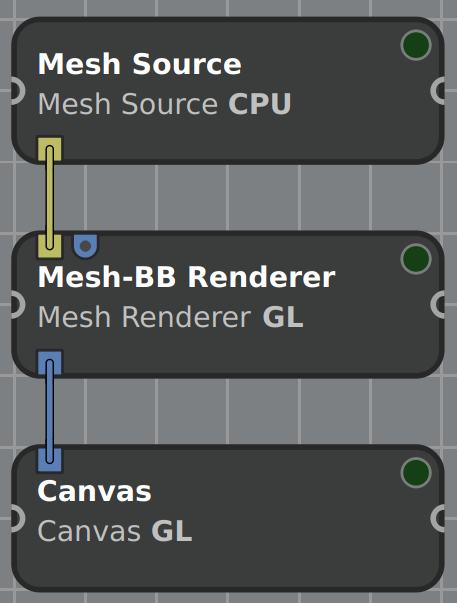

# Data Structures
In Inviwo the main core data structures (`Volume`, `Layer`, `Buffer`) use a pattern of handles and representations. Note that there also exists the `Image` and `Mesh` data structure which are containers of `Layer`s and `Buffer`s respectively. The volume data structure for example has a handle class called `Volume`. The handle class by itself does not have any data, it only stores metadata, and a list of representations. The representations is where the actual data is stored. Therefore, an `Image` or `Mesh` representation is a container for `Layer` and `Buffer` representations of the same representation type. The following first explains the basic data structures and how they relate, then shows what different representations exist and how to use them.

## The different structures
In Inviwo, the `Volume` class wraps volumetric data, more specifically data in a 3D structured grid, also with possibly multiple channels.

The `Image` class consists of a set of `Layer`s, usually a color layer (what we would regularly think of as an image), a depth layer and a picking layer.
As an effect, most `Image` ports in Inviwo actually transfer multiple images in the conventional sense. In this example the `Image` would contain a `Vec3UInt8` color layer, a `Float32` depth layer and a `UInt8` picking layer. Of course you can add more layers to the images in your custom processors as necessary.
<details>
<summary>What is a picking layer?</summary>
The picking layer basically encodes object instance IDs in color, so that a lookup in the picking layer gives the object ID for the pixel of interest. This is used for example to drag'n'drop objects in 3D space.
</details>

The third big data structure in Inviwo is the `Mesh` which consists of a set of `Buffer`s. A `Buffer` is basically a wrapper for some linearly stored data and the `Mesh` holds a list of index buffers and data buffers, such as vertex positions, normals, colors etc.

# Memory Representations

Any data structure can have a set of different representations, for example a `Volume` has a `VolumeRAM` representation and a `VolumeGL` representation. The representation basically determines where the data actually is. In general there are representations for `Disk`, `RAM`, `GL` and if needed also `CL`, where the latter refer to *OpenGL* and *OpenCL* representations respectively.


At any time at least one of the representations should be in a valid state. Whenever we want to access the data of a volume we will ask the `Volume` for a representation of some kind, and the handle is then responsible to try and provide that to us. If the requested representation is valid the handle can just return that representation. Otherwise, it will have to find a valid representation and try to either create the desired representation from that or convert it. (More on conversions below)

When asking a data handle for a representation, you can either ask for a read-only representation using `getRepresentation<>()` or for an editable representation using `getEditableRepresentation<>()`. Note that editing a  representation invalidates all other representations in the handle, since they have not received the updates and are thus out of sync.

## Conversion between Representations

Instead of specifying all representations directly for all objects, you can define a `RepresentationConverter`, which can then automatically convert between two representations.
For example a typical use case can be that we start with a `Volume` handle with a `VolumeDisk` representation and we want to do raycasting using OpenGL. In our processor we will then ask the `Volume` for a `VolumeGL` representation. The volume will see that there are currently no such representations. It will then try and find a chain of `RepresentationConverters` to create that representation. In this case that might be a `VolumeDisk2RAMConverter` that will read in the file from `Disk` into `RAM`, and a `VolumeRAM2GLConverter` that will upload the data to the graphics card. The data handle will always try and find the shortest chain of converters. I.e. if there was a `VolumeDisk2GLConverter` that one would have been used instead.

## Example: Accessing the data in C++
Now that we know how to get the desired representations, let's see how to safely access the data within using the dispatch concept. We will look at rendering a mesh with its bounding box as an example.



Starting in the `Mesh Source`, we load a `Mesh` from disk, thus our `Mesh` handle is initialized with a set of buffers, each containing a `BufferRAM` representation. Note that `Mesh` (and `Buffer`) have no `DiskRepresentation`, while there exist `DiskRepresentation`s for `Volume`, `Image` and `Layer`. However only some readers can actually load a `DiskRepresentation`, depending on how the data is stored on disk. The idea of the `DiskRepresentation` is to only load metadata and to be able to load data into memory partially later to save memory. Some data formats need the whole file to be loaded to memory in order to access all metadata, in which case the loader directly uses a `RAMRepresentation`.

The `Mesh` is passed on to the next processor with the `RAMRepresentation`s attached. The `Mesh-BB Renderer` shall be a modified `Mesh Renderer` that also computes the meshes bounding box on CPU and takes care of rendering it. We will only look in detail at the bounding box computation and in particular how the vertex data is accessed.
In the `Mesh-BB Renderer` processor, the first thing we do is computing the bounding box. As a first step, we will retrieve the appropriate `BufferRAM` representation from the `MeshInport` named `meshInport_`:
```cpp
std::shared_ptr<const Mesh> mesh = meshInport_.getData(); // Get Mesh handle
auto buf = mesh->getBuffer(BufferType::PositionAttrib);   // Get position buffer
// If buffer exists and is not empty
if (buf != nullptr && buf->second->getSize() > 0) {
    const auto minmax = buf->second          // Get actual pointer to buffer
        ->getRepresentation<BufferRAM>()     // Get RAM representation
        ->dispatch<std::pair<dvec4, dvec4>>( // Dispatch to produce a pair of vec4s as result
            [](auto br) { //  Define the lambda for all ValueTypes
                // br's type in this example: BufferRAMPrecision<ValueType, BufferTarget::Data>
                // which means it holds values of type ValueType and is a Data buffer
                // ValueType can be extracted from br's complex type like so:
                using ValueType = util::PrecisionValueType<decltype(br)>;
                const auto &data = br->getDataContainer(); // Gets you a std::vector<ValueType>&
                // Construct result as pair of ValueTypes
                using Res = std::pair<ValueType, ValueType>;
                // Initialize result with max and min values of given data type
                Res minmax{DataFormat<ValueType>::max(),
                           DataFormat<ValueType>::lowest()};
                // Iterate over buffer, accumulating the min and max components
                minmax = std::accumulate(data.begin(), data.end(), minmax,
                    [](const Res &mm, const ValueType &v) -> Res {
                        // Take component-wise min and max
                        return {glm::min(mm.first, v), glm::max(mm.second, v)};
                });
                // Convert to pair of dvec4, as we specified in dispatch's type parameter
                return std::pair<dvec4, dvec4>{util::glm_convert<dvec4>(minmax.first),
                                               util::glm_convert<dvec4>(minmax.second)};
        });
        // minmax now has the lower left and upper right of the meshes bounding box.
    }
```
We start as expected: first the `Mesh` handle is retrieved, then we find the buffer of interest, which is the vertex position buffer in our case. If this buffer exists, we will request its `BufferRAM` representation. Since this representation already exists in an up-to-date state, it can be retrieved without any memory transfer. On this representation the `dispatch<ResultType>(Lambda)` function is called. The actual data access is limited to the Lambda that is passed to `dispatch()` and the result type must match the given type parameter. The actual computations on the data happens inside this Lambda. If any additional variables from the outside scope are required in the Lambda, they can be passed into the Lambdas scope by adding them into the brackets like so:
```cpp
rep->dispatch<ResultType>( [ &varFromOutsideScope ] (auto br) { ... })
```
The Lambda must also take one parameter, in this case `auto br`, that specifies the actual data type of the elements inside the `Buffer`. By using `auto`, we have C++ define the operation for all possible `ValueType`s, which is a [specified list of types](https://github.com/inviwo/inviwo/blob/master/include/inviwo/core/util/formats.h#L55). This way we define the function in a type-agnostic way and it will work for all data types that are used inside Inviwo. Note however, that this also requires the function to compile for all of those types.
To get the correct data type inside of the Lambdas body we can use the following line:
```cpp
using ValueType = util::PrecisionValueType<decltype(br)>
```
This would correspond to `vec3` in our example. Calling `br->getDataContainer()` then gives us direct access to the data by returning a `std::vector<ValueType>` (`std::vector<vec3>` in this example).
From here we can work with the data as we are used to from C++. In this example that means first setting a start value for the bounding box, initializing it with maximimum extents. Next we iterate over the whole vector and reduce it using `glm::min` and `glm::max` which return the component-wise min or max respectively. Lastly we make sure to cast our result to the specified `ReturnType` (`std::pair<dvec4, dvec4>` here). This is a pair of double precision `vec4`s to make sure the computation supports precision up to `double`. Note that `util::glm_convert` casts the result from `vec3`s to `dvec4`s here, so it casts them from `float` to `double` and also adds a fourth component (defaulting to value `1`).

When the bounding box is computed and the processor starts to render the mesh, it will request a `MeshGL` (and thus `BufferGL`) representation. Since that does not exist, the `BufferRAM` representations are converted to `BufferGL` representations by uploading the buffers as OpenGL buffers to the GPU. The rendering process then writes to a frame buffer, which is wrapped into an `Image` with different `Layer`s, each of which has a `LayerGL` representation only. Since the rendered image is never needed on CPU, there will only be this representation in our example.
