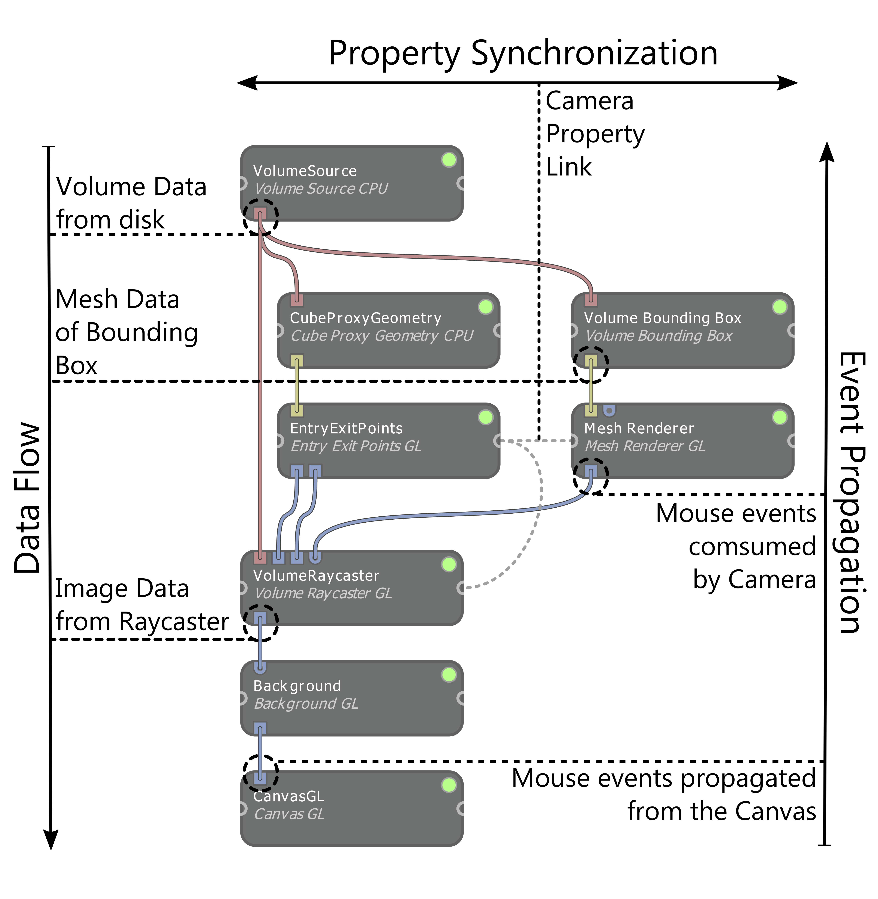

# The Inviwo Network
Inviwo networks are built around a few concepts in order to keep the resulting graphs clean and deterministic.
This guide explains those concepts and clarifies the chronological order of processor execution.

Overall the networks are built to roughly represent the *Visualization Pipeline*, thus there is a data-flow from the
top to the bottom of the network. Note that there must not be cycles in the graph!
This top-to-bottom data flow already enforces the processor executionm to be top-to-bottom as well, since the bottom
processors require the outputs from the previous processors.

In order to keep the application interactive, events (especially Mouse Events from the Canvas) are propagated
upwards in the network until a processor consumes the event. Every processor on the way upwards can look at the event
and determine whether this event *invalidates* the processor (TODO: link to invalidation), which means this processor has to update its outputs. Furthermore, if a processor is invalidated this way, this also invalidates all subsequent processors below. After all events are processed and all processors that are invalid are now marked as such, the network
is re-evaluated, meaning all invalid processors are re-executed exactly once.
Any processors above the consuming processor(s) are unaffected and do not recompute their outputs. If no processor consumes the event, it is propagated up to the source processors, but unless the event invalidates a processor, it won't be re-evaluated.

Let's take camera manipulation as an example (compare figure below): A drag gesture (click and move) was executed in the Canvas in order to rotate the camera.
This triggers a *Mouse Move Event* which is propagated upwards. In the figure below you can see the event goes upwards until
it is consumed by the *VolumeRaycaster*, but it does not reach either the *EntryExitPoints*, nor the *MeshRenderer*.
As a reaction to the event, the *VolumeRaycaster* updates its *CameraProperty* and with that invalidates the processor.
Since the *CameraProperty* is linked to the camera properties of both the *EntryExitPoints* and the *MeshRenderer* processor
(see Property Linking TODO: link), they are also invalidated due to the change in their camera parameters.

Note: A processor is always re-evaluated when its input changes and different *Invalidation Levels* can be set for properties.
That means in code you have control over which property changes trigger a re-computation of your network.

## Image Resize Events TODO: is code specific, move
A large portion of a typical network's processors has Images as inputs and outputs. In order to keep track of a proper image resolution, the *Canvas* which displays
the final resulting image, emits resize events whenever
the canvas resolution is adapted.
