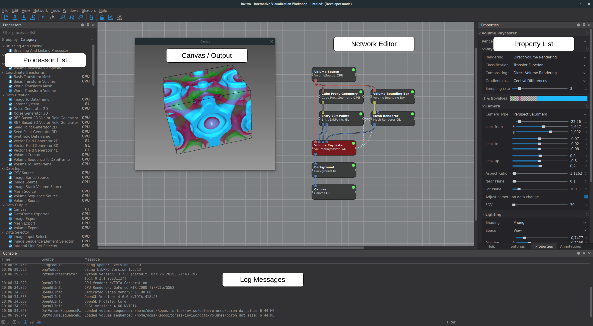
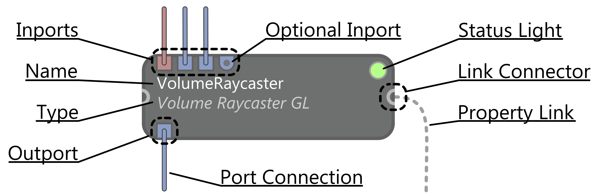
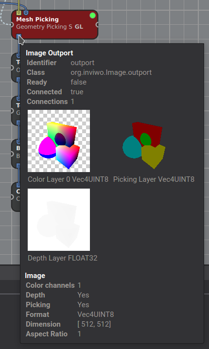
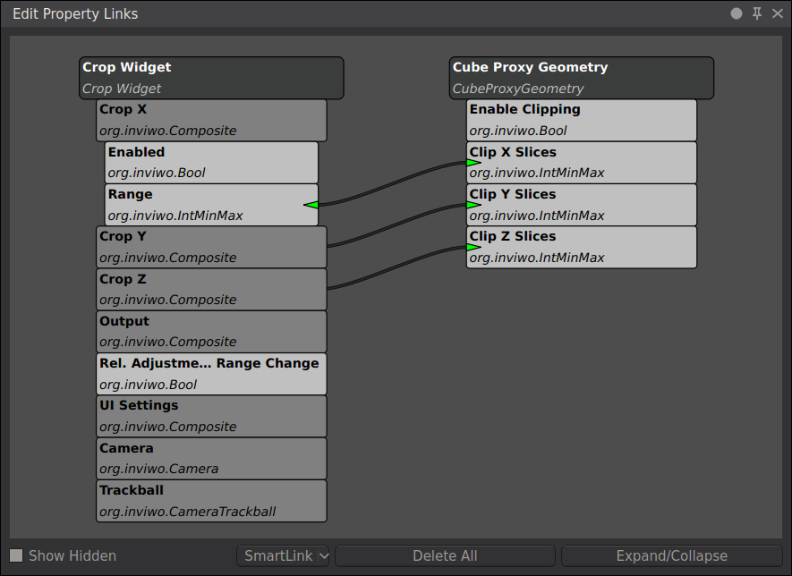
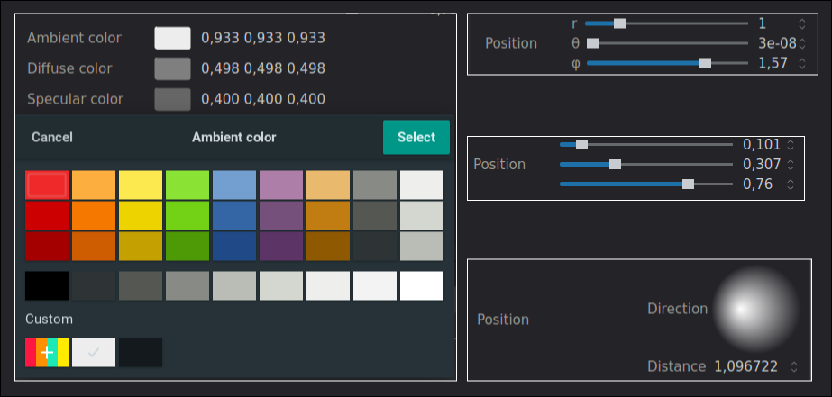

# The Inviwo Graphical Interface
This part of the Getting Started Guide explains Inviwo's graphical user interface and the rough concepts
of its building blocks. The goal of this guide is to give an intuitive feeling for the GUI and enable
users to build workspaces from existing processors.

## GUI Overview
The following image shows Inviwos GUI:

As you can see, the main area consists of the *Network Editor*,
surrounded by the [*Processor*](#markdown-header-processors) *List* on the left, the selected processor's
[*Properties*](#markdown-header-properties) to the right and the *Debug Console* with log messages below.

You can drag processors from the *Processor List* into the *Network Editor* using drag and drop.
Processors are the basic building blocks of the network and perform one encapsulated action.
Each processor can define its required input and produced output data through [*Ports*](#markdown-header-ports),
which can be connected using the mouse. The resulting network represents a directed acyclic graph where
the nodes are processors and the edges are port connections.
In addition to inputs and outputs, a processor's [*Properties*](#markdown-header-properties) can be edited
on the right when the processor is selected. Those properties represent the configuration of the processor and
expose parameters to the user. Changing a property updates the network's results interactively.
Examples for processors include:

- *Source* processors that are mainly used to load data (e.g. Volume Source, Mesh Source, Image Source).
  They have no inports and only output the loaded data through their outports. The according file location
  is set in a property.

- Processors that perform special algorithms (e.g. Volume Raycaster, Mesh Renderer, Image Invert).
  They have inports to receive input data and outports to access the algorithm's result. Their properties
  include lighting options, camera settings, as well as more specific parameters.

- *Sink* processors which only have inports, but no outports. For example the Canvas which displays an
  incoming image and has no outputs.

The whole network, namely all the processors, their connections and properties can be saved together as a *Workspace*. Loading a workspace therefore restores the complete state of the network, including all parameters, processor placement, etc.

Pro Tip!

 - You can re-initialize a processor by dragging the processor from the list on top of the already initialized processor
  in your network.

- Holding `Shift` while dropping the processor in the network will attempt to connect processors above automatically.

- Some properties are linked automatically when initialized, for example the camera. Holding `Alt` while dropping
  the processor will prevent automatic linking. (See [Property Linking](#markdown-header-linking))

## Processors
Processors are the basic building blocks for an Inviwo network. The actual graphical processor elemenet encodes a lot of information, as the following figure shows:

First and foremost, the *inports and outports* show to which other processors this processor is connected, encoding the received and produced data types with colors. Also, they show immediately which information is mandatory and what is additional optional input.
The *Status Light* signals whether the processor has successfully produced an output, meaning it has all necessary inputs connected and could process them without any fatal errors.
Lastly, you can connect a processors properties to (the same type of) properties in other processors by dragging a connection from the *Property Link Connector* to another processor. The actual linking mechanism is explaiend [below](#markdown-header-linking).

To create your own custom processors, look at TODO: link to tut

## Ports
As explained above, a processor's ports determine the inputs and outputs of the operation that is executed in a processor. A dot inside the port marks that the port is optional and the processor should work without connecting it. A port's color shows of which type the data is that flows through it, for example red for volumes, yellow for meshes and blue for images. To directly inspect the data that flows through a port, you can look at the *Port Inspector* by hovering over a port:

This will show you the exact type, metadata like spatial dimensions and an actual preview of the data. When debugging a network, checking all inputs and outputs with the port inspector is often a good first step.
Note that some inports are *multi inports*, meaning you can connect multiple outports to it. All the data from the connected outports is then available to the processor as a list.

## Properties
Properties let you define the configuration of a processor. That means they contain all parameters of a processor in an organized way, allowing for easy manipulation using boxes, sliders and widgets like a color picker.

In addition to simple manipulation of parameters, properties can be *linked* together with properties from other processors in order to synchronize. Upon dragging a link from the *Property Link Connector* (see figure in the [Processors](#markdown-header-processors) section) onto another processor, the following window opens:

This window lists all properties that can potentially be linked with the other processor's properties. Basically you can link anything that shares the same type. *Composite Properties* (properties that contain more properties) can be unfolded to reveal the underlying, more simple properties, which can be linked indivudally as well. When a link between two properties is dragged, a *bidirectional* link is established, meaning that a change to either property will update the other as well. By clicking on the link you can swap through *unidirectional* links. Note that some properties are linked automatically by default, like the *CameraProperty*. This ensures that all processors that require camera information get the same parameters and enables you to display multiple renderings in the same canvas. In a multi-canvas setup, where multiple viewports are required, some of those links might need to be removed. You can also prevent automatic linking in the settings or by holding `Alt` while dragging in the processor.

Another important aspect of properties is *Property Semantics*. This is basically another abstraction of a property, allowing for a different representation in the user interface. Take for example 3D vectors. They are used to represent 3D positions, directions and colors. The following image shows how, according to the *semantic*, different graphical representations can be used to make the property intuitive to set.

On the left there is a color picker for color Vec3's. On the right there are two position semantics. The top one is a polar coordinate and the other is just settings the coordinate components directly.
On the bottom right you can also see the *LightPosition* semantic where you can drag the cursor over the sphere to set the light direction graphically.

A property always has to define a default value and a certain range of possible values. For a normal floating point number that range determines the min and max of the slider.

You can edit both the semantics and the defaults / value range by right clicking a property and selecting *Semantics* or *Property settings* respectively.
