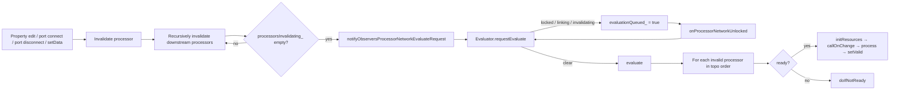
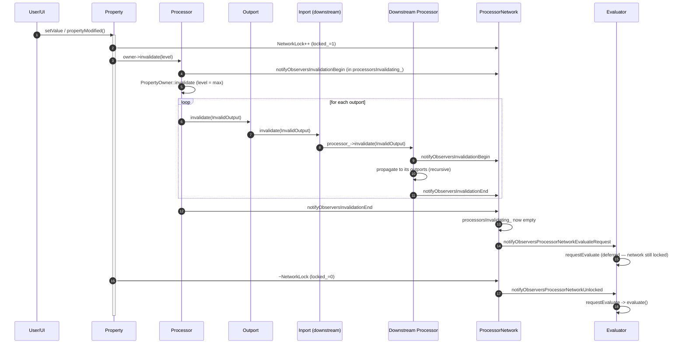
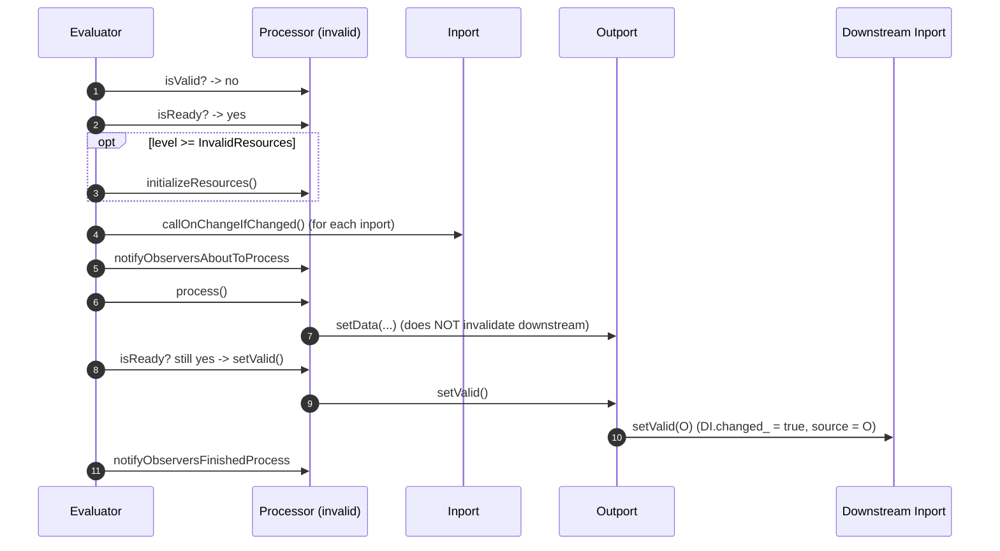

# Processor Network Invalidation and Evaluation

This document describes — in depth — how the Inviwo `ProcessorNetwork` decides
*what* must be re-processed, *when* evaluation actually happens, and *how* errors
are handled. The mechanism is built from several cooperating pieces
(`Processor`, `Property`, `Inport`/`Outport`, `StateCoordinator`,
`ProcessorNetwork`, `NetworkLock`, `ProcessorNetworkEvaluator`) whose
interactions are not obvious from any single class. The goal of this document
is to give a full mental model and to highlight subtle behaviors and potential
pitfalls.

> Audience: developers writing processors, debugging "my processor does not
> run / runs too often" problems, or modifying the evaluator itself.

---

## 1. The Big Picture

Conceptually, the system is a *pull-based, dirty-tracking* dataflow engine
running over a DAG of [`Processor`](../../include/inviwo/core/processors/processor.h)
nodes connected through [`Inport`](../../include/inviwo/core/ports/inport.h) and
[`Outport`](../../include/inviwo/core/ports/outport.h):

1. A *change* (property edit, port connect/disconnect, new data on an outport)
   marks one or more processors **invalid**.
2. Invalidation **propagates downstream** through outports → connected inports
   → owning processors, recursively.
3. When the recursive invalidation finishes, the network asks the
   [`ProcessorNetworkEvaluator`](../../include/inviwo/core/network/processornetworkevaluator.h)
   to evaluate.
4. The evaluator visits processors in **topological order from sinks upward**
   (sinks last) and, for each invalid + ready processor, runs
   `initializeResources()` (if needed), inport `onChange` callbacks, then
   `process()`.
5. On success, the processor is marked `Valid`; its outports propagate
   `setValid()` downstream which marks the next layer of inports as
   *changed* (i.e. "you got new data"), and the cycle is consistent again.

The whole thing is gated by:

- **`NetworkLock`** — RAII lock that defers evaluation while edits are in flight.
- **Invalidation tracking** — evaluation is requested only after *all* in-flight
  invalidations have ended.
- **`isLinking()`** — defers evaluation while property links are being executed.



---

## 2. Core Building Blocks

### 2.1 `InvalidationLevel`

Defined in
[invalidationlevel.h](../../include/inviwo/core/properties/invalidationlevel.h):

```cpp
enum class InvalidationLevel {
    Valid,            // Output is current; nothing to do
    InvalidOutput,    // process() must run again
    InvalidResources  // initializeResources() + process() must run again
};
```

These are ordered numerically (`Valid < InvalidOutput < InvalidResources`).
Invalidation is **monotonic**: a `PropertyOwner` only ever takes the *max* of
its current and the incoming level:

```cpp
// src/core/properties/propertyowner.cpp
void PropertyOwner::invalidate(InvalidationLevel level, Property*) {
    invalidationLevel_ = std::max(invalidationLevel_, level);
}
```

So a sequence of mixed invalidations always collapses to the most expensive
one. `setValid()` is the only thing that lowers the level (back to `Valid`).

### 2.2 `StateCoordinator<T>`

[statecoordinator.h](../../include/inviwo/core/util/statecoordinator.h) provides
a small reactive cache:

- Stores a *cached* value of type `T`.
- Holds an *updater* (computes a fresh value on demand).
- Holds a *notifier* (called when `update()` produces a different value).
- `get()`/`operator const T&` returns the cached value without recomputing.
- `setNotify(...)` replaces the notifier (used when ports register interest).

`Processor` owns three of these:

```cpp
// src/core/processors/processor.cpp (ctor)
isReady_  { true, [this](const bool&){ notifyObserversReadyChange(this); },  getDefaultIsReadyUpdater(this) },
isSink_   { true, [this](const bool&){ notifyObserversSinkChange(this); },   [this]{ return outports_.empty(); } },
isSource_ { true, [this](const bool&){ notifyObserversSourceChange(this); }, [this]{ return inports_.empty(); } },
```

`isReady_` stores a [`ProcessorStatus`](../../include/inviwo/core/processors/processorstatus.h)
(`Ready | NotReady | Error` plus optional reason string), not just a bool. The
default updater is:

```cpp
// src/core/processors/processor.cpp
auto Processor::getDefaultIsReadyUpdater(Processor* p) {
    return [p]() -> ProcessorStatus {
        if (p->allInportsAreReady()) return ProcessorStatus::Ready;
        else                         return ProcessorStatus::NotReady; // with reason
    };
}
```

`update()` is called whenever an event might change readiness:

- An inport is added/removed (`addPortInternal` / `removePort`).
- A connected outport's `isReady_` changes (each inport hooks into its
  outport's `setNotify` to call `isReady_.update()` on the owning processor).
- An inport's `isOptional_` flips.

### 2.3 `ProcessorStatus`

A small value type encapsulating one of `{Ready, NotReady, Error}` plus a
human-readable reason. It is the *cached* value inside `Processor::isReady_`.
`Processor::status()` returns it; `Processor::isReady()` returns the boolean
projection.

---

## 3. Ports

### 3.1 `Inport`

State of interest:

| Member | Meaning |
|---|---|
| `StateCoordinator<bool> isReady_` | Connected **and** at least one connected outport is ready (unless optional). |
| `StateCoordinator<bool> isOptional_` | Whether the inport may stay unconnected. |
| `bool changed_` | Has fresh data arrived since last evaluation of the owning processor? |
| `std::vector<const Outport*> changedSources_` | Which outports delivered the change. |

Important methods:

| Method | Effect |
|---|---|
| `isReady()` | Cached readiness (connected + all sources ready, or optional). |
| `isChanged()` | Has new data arrived? |
| `invalidate(level)` | Called by an upstream outport. Triggers `onInvalidCallback_` on the first valid→invalid transition, then **calls `processor_->invalidate(level)`** — this is how invalidation walks upward into the next processor. |
| `setValid(const Outport* src)` | Called by `Outport::setValid()` after the producing processor succeeded; marks the inport as *changed from `src`*. |
| `setChanged(bool, src)` | Toggles the `changed_` flag and maintains `changedSources_`. |
| `callOnChangeIfChanged()` | The evaluator calls this just before `process()` to invoke user `onChange` callbacks. |

Connect/disconnect both call `setChanged(true)`, update readiness, and finally
`invalidate(InvalidOutput)` — i.e. *topology changes are themselves
invalidations*.

### 3.2 `Outport`

| Member | Meaning |
|---|---|
| `StateCoordinator<bool> isReady_` | Subclass-defined: e.g. `DataOutport` returns true iff data is present and `invalidationLevel_ == Valid`. |
| `InvalidationLevel invalidationLevel_` | Current level of this outport. |
| `std::vector<Inport*> connectedInports_` | Downstream consumers. |

| Method | Effect |
|---|---|
| `invalidate(level)` | Called from `Processor::invalidate`. Records the level, then calls `inport->invalidate(level)` on every connected inport (propagation), then updates the readiness cache. |
| `setValid()` | Called from `Processor::setValid`. Resets level to `Valid`, calls `inport->setValid(this)` on every connected inport. |

`DataOutport::setData(...)` only stores the new data and refreshes
`isReady_` — it does **not** propagate any invalidation. Downstream wakeup
happens later, via the parent processor's `setValid()` cycle (see §6.1
"Pitfalls").

---

## 4. Properties

[`Property::propertyModified()`](../../src/core/properties/property.cpp) is the
canonical entry point that turns a UI/script value change into an invalidation:

```cpp
Property& Property::propertyModified() {
    NetworkLock lock(this);                 // defer evaluation while we mutate
    onChangeCallback_.invokeAll();          // user onChange
    setModified();

    if (auto owner = getOwner()) {
        if (auto p = owner->getProcessor()) {
            p->notifyObserversAboutPropertyChange(this); // for property links
        }
        if (getInvalidationLevel() > InvalidationLevel::Valid) {
            owner->invalidate(getInvalidationLevel(), this);
        }
    }
    updateWidgets();
    return *this;
}
```

Two important consequences:

- Every property edit is wrapped in a `NetworkLock`; the evaluator only runs
  once the **final** `unlock()` decrements the counter to zero.
- A property's `InvalidationLevel` (set when constructed) determines the
  severity of the invalidation. `InvalidResources` is what forces
  `initializeResources()` to re-run.

---

## 5. Processor: invalidate / setValid

```cpp
// src/core/processors/processor.cpp
void Processor::invalidate(InvalidationLevel level, Property* modified) {
    notifyObserversInvalidationBegin(this);    // network adds us to processorsInvalidating_
    PropertyOwner::invalidate(level, modified); // bump invalidationLevel_
    if (!isValid()) {
        // Always re-invalidate outports: a processor with optional inports
        // might have already been invalid but transitively become valid;
        // we must make sure the downstream chain is re-invalidated.
        for (auto& port : outports_) port->invalidate(InvalidationLevel::InvalidOutput);
    }
    notifyObserversInvalidationEnd(this);      // network removes us; may request evaluate
}

void Processor::setValid() {
    PropertyOwner::setValid();    // mark properties unmodified, level = Valid
    setInportsChanged(false);     // clear "changed" on our inports
    for (auto* outport : outports_) outport->setValid(); // wakes downstream inports
}
```

The two `notifyObserversInvalidation*` calls are the hook into the network's
[in-flight invalidation tracker](#62-evaluation-is-only-triggered-when-all-invalidations-finish).

Note: outports are always invalidated at `InvalidOutput`, never at
`InvalidResources`. Resource invalidation is processor-local; downstream
processors only care that *some* output changed.

---

## 6. The Network

[`ProcessorNetwork`](../../include/inviwo/core/network/processornetwork.h) is
both the container and the orchestrator. The pieces relevant to evaluation are:

### 6.1 The lock counter

```cpp
unsigned int locked_ = 0;
void lock()   { locked_++; }
void unlock() { (locked_>0) ? locked_-- : locked_ = 0;
                if (locked_ == 0) notifyObserversProcessorNetworkUnlocked(); }
bool islocked() const { return locked_ != 0; }
```

The [`NetworkLock`](../../include/inviwo/core/network/networklock.h) RAII guard
calls these. The counter is recursive, so nested locks behave correctly. When
the **outermost** lock releases (`locked_` drops to 0) the network notifies
the evaluator, which is its cue to try running.

### 6.2 Evaluation is only triggered when all invalidations finish

```cpp
// src/core/network/processornetwork.cpp
bool ProcessorNetwork::isInvalidating() const { return !processorsInvalidating_.empty(); }

void ProcessorNetwork::onProcessorInvalidationBegin(Processor* p) {
    util::push_back_unique(processorsInvalidating_, p);
}
void ProcessorNetwork::onProcessorInvalidationEnd(Processor* p) {
    std::erase(processorsInvalidating_, p);
    if (processorsInvalidating_.empty()) {
        notifyObserversProcessorNetworkEvaluateRequest();
    }
}
```

So a single user action that invalidates 20 processors triggers *one*
evaluation request, not 20.

### 6.3 Topological sort

[`util::topologicalSortFiltered`](../../src/core/network/networkutils.cpp)
starts from every processor for which `isSink()` is true and performs a
post-order DFS upward following only **active** connections
(`Processor::isConnectionActive(in, out)`). "Filtered" means processors can
deactivate certain port connections at runtime (e.g. a switch). Plain
`topologicalSort` follows all connections.

The evaluator caches the sorted vector and re-sorts only when topology really
changes:

- processor added/removed,
- connection added/removed,
- `onProcessorSinkChanged`,
- `onProcessorActiveConnectionsChanged`.

---

## 7. The Evaluator Loop

The single piece of code that actually executes the network is
[`ProcessorNetworkEvaluator::evaluate`](../../src/core/network/processornetworkevaluator.cpp):

```cpp
void ProcessorNetworkEvaluator::evaluate() {
    const NetworkLock lock(processorNetwork_);   // prevent re-entrancy
    notifyObserversProcessorNetworkEvaluationBegin();

    if (needsSorting_) {
        processorsSorted_ = util::topologicalSortFiltered(processorNetwork_);
        needsSorting_ = false;
    }

    for (auto* processor : processorsSorted_) {
        if (!processor->isValid()) {
            if (processor->isReady()) {
                try {
                    if (processor->getInvalidationLevel() >= InvalidationLevel::InvalidResources)
                        processor->initializeResources();
                } catch (...) { exceptionHandler_(processor, EvaluationType::InitResource, {}); continue; }

                try {
                    for (auto* inport : processor->getInports()) inport->callOnChangeIfChanged();
                } catch (...) { exceptionHandler_(processor, EvaluationType::PortOnChange, {}); continue; }

                processor->notifyObserversAboutToProcess(processor);
                try {
                    processor->process();
                    if (processor->isReady()) processor->setValid();  // (*)
                } catch (...) { exceptionHandler_(processor, EvaluationType::Process, {}); }
                processor->notifyObserversFinishedProcess(processor);

            } else {
                try { processor->doIfNotReady(); }
                catch (...) { exceptionHandler_(processor, EvaluationType::NotReady, {}); }
            }
        }
    }
    notifyObserversProcessorNetworkEvaluationEnd();
}
```

The guard at `(*)` deserves attention: a callback fired during `process()`
(for example a downstream property link, or a logging callback that touches
an inport) may have *re-invalidated* this processor's inputs. Calling
`setValid()` in that case would lie about the state, so it is skipped.

### 7.1 The `requestEvaluate()` gate

```cpp
void ProcessorNetworkEvaluator::requestEvaluate() {
    if (evaluationQueued_) return;
    if (processorNetwork_->isLinking())     { evaluationQueued_ = true; return; }
    if (processorNetwork_->islocked())      { evaluationQueued_ = true; return; }
    if (processorNetwork_->isInvalidating()){ evaluationQueued_ = true; return; }
    evaluationQueued_ = false;
    evaluate();
}
```

Three deferral conditions:

1. **Linking** — property-link propagation is running; let it finish first.
2. **Locked** — someone holds a `NetworkLock`.
3. **Invalidating** — at least one processor is still inside `invalidate()`.

If any of these is true, evaluation is *queued*. The two wakeup paths are
`onProcessorNetworkUnlocked` (lock released) and
`onProcessorNetworkEvaluateRequest` (called from invalidation end or by user
code), both of which re-enter `requestEvaluate`.

---

## 8. End-to-End Flow

### 8.1 Sequence: a property edit



### 8.2 Sequence: one pass of evaluate



### 8.3 State diagram for one processor

```mermaid
stateDiagram-v2
    [*] --> Valid
    Valid --> InvalidOutput: property/port change\n(level=InvalidOutput)
    Valid --> InvalidResources: property change\n(level=InvalidResources)
    InvalidOutput --> InvalidResources: stronger invalidation arrives
    InvalidResources --> InvalidResources: weaker invalidation (max wins)
    InvalidOutput --> Processing: evaluator picks it up, isReady()
    InvalidResources --> Processing: evaluator picks it up, isReady()
    Processing --> Valid: process() ok && isReady()
    Processing --> InvalidOutput: process() ok but inputs re-invalidated
    Processing --> InvalidOutput: process() / initRes / onChange threw
    InvalidOutput --> NotReadyHandled: evaluator picks it up, !isReady()
    InvalidResources --> NotReadyHandled: evaluator picks it up, !isReady()
    NotReadyHandled --> InvalidOutput: stays invalid; waits for inputs
```



---

## 9. Error Handling

The evaluator wraps each phase in a `try/catch(...)` and routes failures to
`EvaluationErrorHandler` along with one of:

```cpp
enum class EvaluationType { InitResource, PortOnChange, Process, NotReady };
```

The default
[`StandardEvaluationErrorHandler`](../../src/core/network/evaluationerrorhandler.cpp)
re-throws to identify the exception type, then logs it via `log::exception` /
`log::report`. Custom handlers can be installed via
`ProcessorNetworkEvaluator::setExceptionHandler(...)` to do extra work (modal
dialogs, telemetry, mark the processor red, etc.).

**Effect on processor state per phase:**

| Phase | On throw | Net effect |
|---|---|---|
| `initializeResources()` | logged; `continue` — `process()` skipped | processor stays invalid; will retry on next evaluate cycle |
| `callOnChangeIfChanged()` | logged; `continue` — `process()` skipped | same |
| `process()` | logged; **does not** `continue`; `notifyObserversFinishedProcess` still fires | processor stays invalid; will retry next cycle |
| `doIfNotReady()` | logged | processor stays invalid (intended); will keep being called until ready |

In all four cases, the failing processor's outports keep their old
`invalidationLevel_ > Valid`. Downstream processors therefore stay invalid
too, and (unless their inports are optional) they will report `NotReady` and
fall into the `doIfNotReady()` branch. Bad data does not silently flow
through.

---

## 10. Pitfalls & Subtleties

This section is a candid list of things that are easy to get wrong, plus
behaviors that are correct-but-surprising.

### 10.1 `Outport::setData()` does **not** invalidate downstream

`DataOutport::setData()` updates `isReady_` only. Downstream processors are
woken up later inside `Processor::setValid()` when the *containing*
processor's evaluation finishes. Consequences:

- If you call `setData()` from **outside** `process()` (e.g. background
  thread, timer, async I/O), downstream processors will *not* re-evaluate by
  themselves. You must additionally call
  `Processor::invalidate(InvalidationLevel::InvalidOutput)` (typically from
  the main thread).
- Conversely, calling `setData()` from `process()` and not exiting the
  function is fine; the evaluator drives `setValid()` afterwards.

### 10.2 Failure modes can loop indefinitely

If `initializeResources()` or `process()` consistently throws:

- The processor stays invalid forever (`setValid()` is never called).
- *Every* subsequent evaluation cycle retries the same call, and any future
  invalidation in the network re-enters `evaluate()` which retries again.
- There is **no backoff and no "broken" flag**. The cost is paid on every
  evaluation request.

For shader compile failures and similar deterministic errors, processors
should catch internally, save a "broken" state, and degrade gracefully (e.g.
clear the outport with a sentinel) so that downstream consumers can become
`Valid` instead of permanently `NotReady`.

`doIfNotReady()` is called on *every* pass until the processor becomes ready —
keep it cheap and idempotent.

### 10.3 No throttling / debouncing

A loop that writes a property 1000 times in quick succession produces 1000
invalidate / evaluate cycles unless the caller wraps the loop in a single
`NetworkLock`:

```cpp
{
    NetworkLock lock(network);
    for (...) prop.set(...);
}   // one evaluation when the lock releases
```

This is the canonical pattern for batched edits.

### 10.4 The "still ready?" check after `process()`

```cpp
processor->process();
if (processor->isReady()) processor->setValid();
```

If a callback fired during `process()` invalidates this processor's inputs
again, the processor is *not* marked valid and the evaluator simply moves on.
The current evaluation pass does **not** re-run this processor; instead, the
next evaluation cycle (triggered by the lock-release that ends the property
change) will re-process it. That cycle starts a fresh top-to-bottom pass.

Be careful: this means that if your `process()` toggles a property on itself
in a way that bumps the level, you can get an infinite re-evaluation cycle.
The convention is that `process()` must not modify properties whose
invalidation level is `InvalidOutput` or stronger on its own processor.

### 10.5 Topology changes during evaluation use the **old** sort

`needsSorting_` is set by topology-changing observer callbacks, but
`evaluate()` checks it only at the top. If a connection is added during
`callOnChangeIfChanged()` or `process()`, the rest of the current pass uses
the previous sort. The new sort is built at the start of the next cycle.

### 10.6 `topologicalSortFiltered` only visits ancestors of sinks

A processor that is reachable from no sink (`isSink()` returns false) is
**never evaluated**. By default a processor is a sink iff it has no
outports; processors with outports must override their `isSink_` updater
(`Processor::isSink_.setUpdate(...)`) if they have observable side-effects
that should run even without downstream consumers. This is intentional —
"pure" processors with no consumer should not run — but it bites people
writing logging / file-writer processors that *do* have outports.

### 10.7 Optional inports and the "always invalidate outports" comment

```cpp
if (!isValid()) {
    for (auto& port : outports_) port->invalidate(InvalidationLevel::InvalidOutput);
}
```

This re-invalidates outports even when the processor was already invalid.
The comment explains: a processor with optional inports may have been invalid
*and ready* on a previous evaluation cycle. If new invalidation arrives, the
outports must be re-pushed because the downstream chain may have validated in
the meantime via a different path. Forgetting this would silently leave
stale data downstream.

### 10.8 `Inport::setValid` does not actually mean "valid"

The name is historical. `Inport::setValid(source)` is called from
`Outport::setValid()` and its effect is to **mark the inport as changed
from `source`** — i.e. "new data has been published". This is what makes
`callOnChangeIfChanged()` fire on the next pass.

### 10.9 Property links and evaluation interleaving

`Property::propertyModified()` notifies observers, including the
`PropertyLink` graph. Link execution is what `ProcessorNetwork::isLinking()`
guards; while a link evaluation is in progress (`linkEvaluator_.isLinking()`),
the evaluator defers. This is essential — a link can rewrite many properties,
and we want a single coalesced evaluation afterwards.

### 10.10 Errors are not visible from the processor's `status()`

The default error handler logs and returns. It does **not** flip
`isReady_` to the `Error` `ProcessorStatus`. So the UI cannot tell, by
calling `processor.status()`, that the last `process()` threw — only the
log knows. Processors that want UI-visible error states must override
the `isReady_` updater (`isReady_.setUpdate(...)`) and report `Error` with
a reason. This is an easy thing to forget.

### 10.11 Reentrancy

`evaluate()` first takes a `NetworkLock`. Any code inside `process()` that
itself calls `propertyModified()` or `addConnection()` will *queue* a new
evaluation request through the gate but cannot start a nested `evaluate()`
because the lock is held. The new evaluation runs when the lock releases at
function exit. This guarantees there is no recursive `evaluate()` invocation,
even with poorly-behaved processors.

### 10.12 No multi-threaded evaluation

`evaluate()` is single-threaded by design and there is no internal
synchronization on the rest of the network state. Processors that spawn
workers must marshal results back to the main thread (typically using a
`std::function` queue executed by an `InviwoApplication::dispatchFront` /
event loop tick) before calling `setData()` / `invalidate()`.

---

## 11. Observer/Notification Map

Quick reference for who notifies whom and why:

| Notification | Source | Listener of interest | Purpose |
|---|---|---|---|
| `invalidationBegin/End` | `Processor::invalidate` | `ProcessorNetwork` | Track in-flight invalidations, request evaluate when empty |
| `processorNetworkEvaluateRequest` | `ProcessorNetwork` | `Evaluator` | Schedule evaluation |
| `processorNetworkUnlocked` | `ProcessorNetwork::unlock` | `Evaluator` | Wake up after deferred state |
| `aboutToProcess` / `finishedProcess` | `Evaluator` | UI / diagnostics | Spinner, profiling |
| `readyChange` | `Processor.isReady_` notifier | UI | Repaint processor icon |
| `sinkChange` / `sourceChange` | `Processor.isSink_` / `isSource_` | `Evaluator` | Mark `needsSorting_` |
| `portAdded` / `portRemoved` | `Processor` | UI / network | UI rewiring, sort invalidation |
| `addConnection` / `removeConnection` | `ProcessorNetwork` | `Evaluator` | `needsSorting_ = true` |
| `aboutPropertyChange` | `Property::propertyModified` | `Processor`, `PropertyLink` | Cross-property synchronization |
| `evaluationBegin` / `evaluationEnd` | `Evaluator` | UI / profilers | Global cycle markers |

---

## 12. Cheat Sheet

- **Make a property invalidate stronger:** set its `InvalidationLevel`
  (`InvalidResources` to force `initializeResources()` to run again).
- **Batch many property edits:** wrap them in `NetworkLock`.
- **Write data outside `process()`:** call `Processor::invalidate(InvalidOutput)`
  yourself so the evaluator wakes up.
- **Make a sink-with-outport:** customise `isSink_`
  (`isSink_.setUpdate([]{ return true; });`) in the constructor.
- **Report a runtime error visibly:** override `isReady_` to return
  `ProcessorStatus::Error{...}` while the error condition holds.
- **Stop an expensive `process()` from re-running on failure:** catch
  internally, store the error, optionally clear the outport, and only retry
  after the user changes a property (i.e. don't keep throwing).
- **Inspect what is happening:** install a custom
  `EvaluationErrorHandler`, or subscribe to
  `ProcessorNetworkEvaluationObserver` for begin/end and to
  `ProcessorObserver` for `aboutToProcess`/`finishedProcess`.

---

## 13. Source Map

| Topic | Files |
|---|---|
| StateCoordinator | [statecoordinator.h](../../include/inviwo/core/util/statecoordinator.h) |
| ProcessorStatus | [processorstatus.h](../../include/inviwo/core/processors/processorstatus.h) |
| InvalidationLevel | [invalidationlevel.h](../../include/inviwo/core/properties/invalidationlevel.h) |
| Processor | [processor.h](../../include/inviwo/core/processors/processor.h), [processor.cpp](../../src/core/processors/processor.cpp) |
| Inport / Outport | [inport.h](../../include/inviwo/core/ports/inport.h), [outport.h](../../include/inviwo/core/ports/outport.h) (`src/core/ports/*.cpp`) |
| Property | [property.cpp](../../src/core/properties/property.cpp), [propertyowner.cpp](../../src/core/properties/propertyowner.cpp) |
| ProcessorNetwork | [processornetwork.h](../../include/inviwo/core/network/processornetwork.h), [processornetwork.cpp](../../src/core/network/processornetwork.cpp) |
| NetworkLock | [networklock.h](../../include/inviwo/core/network/networklock.h), [networklock.cpp](../../src/core/network/networklock.cpp) |
| Evaluator | [processornetworkevaluator.h](../../include/inviwo/core/network/processornetworkevaluator.h), [processornetworkevaluator.cpp](../../src/core/network/processornetworkevaluator.cpp) |
| Topological sort | [networkutils.cpp](../../src/core/network/networkutils.cpp) |
| Error handling | [evaluationerrorhandler.h](../../include/inviwo/core/network/evaluationerrorhandler.h), [evaluationerrorhandler.cpp](../../src/core/network/evaluationerrorhandler.cpp) |
